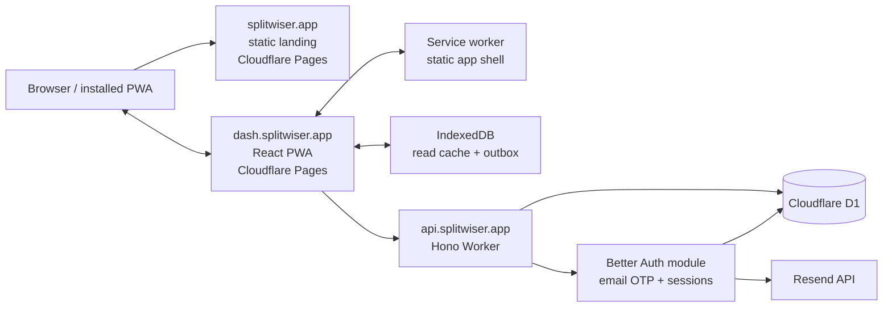

# Splitwiser MVP product and technical specification

Status: implementation-ready proposal  
Last researched: 2026-09-03  
Target: public MVP on free service tiers

## 1. Decision summary

Splitwiser is an installable, mobile-first shared ledger for small groups. It
does not move money and it is not a budgeting product.

| Decision                    | MVP ruling                                                                               |
| --------------------------- | ---------------------------------------------------------------------------------------- |
| Client                      | React 19, TypeScript, Vite 8, shadcn/ui, Tailwind CSS                                    |
| Workspace                   | pnpm workspaces with one private @splitwiser/shared package and one lockfile             |
| Navigation and server state | TanStack Router and TanStack Query                                                       |
| Forms                       | React Hook Form with Zod                                                                 |
| PWA                         | Downloadable/installable PWA with vite-plugin-pwa and a generated Workbox service worker |
| Offline                     | Cached last-read data plus an IndexedDB outbox for new expenses and settlements          |
| API                         | Dedicated Hono Worker at api.splitwiser.app                                              |
| Database                    | One Cloudflare D1 database through Drizzle                                               |
| Frontend hosting            | Separate static Pages projects for the landing site and the complete PWA                 |
| Source and deployment       | GitHub-hosted source; authorized operators deploy manually with OpenTofu and Wrangler    |
| Infrastructure state        | GitLab-managed OpenTofu remote state; never committed to the repository                  |
| Authentication              | Better Auth email OTP presented as a sign-in link plus a visible code fallback           |
| Email                       | Resend through a provider adapter                                                        |
| Money                       | Integer minor units, one ISO 4217 currency per group                                     |
| Ledger                      | One payer; equal or exact-amount splits; balances always derived                         |
| Access                      | Authenticated membership is separate from a financial participant                        |
| Invitations                 | One reusable signed invite URL per group, revocable by rotation                          |
| Payments                    | Recorded as settlements only; the app never handles funds                                |
| Support                     | A plain external Buy Me a Coffee link in About/Settings                                  |

The most important changes from the initial draft are:

1. Email ownership is verified before an account or trusted session is created.
2. The settlement signs in the original balance formula are corrected.
3. Offline writes are in MVP, but only append-only expense and settlement
   creation for an already-synced group.
4. A user account, its access to a group, and its financial identity are modeled
   separately. This makes identity claims and removals safe.
5. Expense date, settlement editing, idempotency, optimistic concurrency,
   activity history, export, and self-service deletion are explicit.

## 2. Product contract

### 2.1 Product statement

A person can verify an email, create a group, share one link, add people who
will never install the app, record expenses, and understand the suggested
repayments without a subscription or app-store install.

The product should feel like:

```text
Create group
→ share link
→ add or claim people
→ add expenses
→ see balances
→ record repayments
→ settled
```

### 2.2 Goals

- Reach the first valid expense within two minutes of opening the app.
- Make the current net position of every participant unambiguous.
- Be downloadable and installable as a true PWA from the browser on supported
  iOS and Android versions, without an app-store package.
- Preserve a newly entered expense through a lost connection, reload, or retry.
- Keep normal operation within ongoing free tiers and never create usage bills.
- Let people exist in a ledger without an account or email address.
- Keep email addresses private from other group members.
- Prefer a small, understandable system over feature breadth.

### 2.3 Non-goals

The MVP does not include:

- payment processing or bank connections;
- multiple currencies or exchange-rate conversion within a group;
- multiple payers, negative expenses, refunds, or reimbursements;
- percent, share, adjustment, or itemized split modes;
- receipt images, OCR, categories, budgets, or spending analytics;
- recurring expenses;
- comments, reactions, avatars, contacts, or a friends graph;
- email invitations, reminders, or push notifications;
- real-time collaboration or WebSockets;
- offline group creation, joins, claims, member changes, edits, or deletes;
- native App Store or Play Store packages;
- social login, passwords, passkeys, or phone authentication;
- subscriptions or premium functionality.

## 3. Terms and domain model

### User

An email-verified person with a persistent application identity. A user may
belong to many groups. Their email is private and is used for authentication.

### Group

A ledger with a name, one currency, participants, expenses, and settlements.

### Participant

A financial identity inside exactly one group. Every payer, borrower, and
settlement party is a participant. A participant may exist without an account.

Examples:

```text
Portugal Trip
Félix    linked to a membership
Marie    linked to a membership
Dad      offline participant only
Alex     unclaimed participant only
```

### Membership

An authenticated user's access record for a group. An active membership links
one user to one participant. There can be at most one membership per user per
group and at most one membership claiming a participant.

Separating membership from participant is intentional:

- adding “Dad” creates only a participant;
- Dad joining creates a membership and claims that participant;
- removing access does not delete Dad's financial history;
- a false claim can be detached without moving any expenses;
- a blocked user cannot simply use the same reusable invite again.

### Expense

A positive amount paid by one participant and allocated as positive shares to
one or more participants.

### Settlement

A positive payment that happened outside the app, recorded from one participant
to another. It changes balances but never initiates a payment.

### Activity event

An append-only record of a meaningful group mutation and its actor.

## 4. MVP scope and product limits

### 4.1 Included at public launch

- Email sign-in link with manual code fallback.
- Persistent secure sessions and logout.
- First-login profile name.
- Create, rename, soft-delete, restore, and export a group.
- One reusable group invite URL; share sheet plus clipboard fallback.
- Join as a new participant or claim an unclaimed participant.
- False-claim repair and invite rotation by the owner.
- Add, rename, archive, and restore offline participants.
- One owner, ownership transfer, member leave/removal rules.
- One currency per group, locked after its first ledger entry.
- Add, edit, and soft-delete expenses.
- Equal and exact-amount splits.
- Derived participant balances and deterministic repayment suggestions.
- Add, edit, and soft-delete settlements.
- A paginated activity list.
- Downloadable/installable PWA with cached last-read group data.
- Durable offline queue for new expenses and settlements.
- Per-group CSV and JSON export.
- Self-service account deletion and privacy/terms pages.
- Discreet external Buy Me a Coffee link.

### 4.2 Initial abuse and complexity caps

These are product limits, not promises about platform maximums:

| Item                        |                      Initial cap |
| --------------------------- | -------------------------------: |
| Active groups per user      |                               50 |
| Participants per group      |                               50 |
| Participants on one expense |                               50 |
| Active invite per group     |                                1 |
| Description length          |                   120 characters |
| Group/participant name      |                    80 characters |
| Ledger entries per group    |                           10,000 |
| Amount                      | 999,999,999 major currency units |
| Activity page size          |                               50 |

The API enforces every cap. Limits can be raised after measuring D1 row and CPU
usage.

## 5. Core user journeys

### 5.1 First sign-in

1. The user enters only their email.
2. The API returns the same generic response whether the account exists or not.
3. The email contains:
   - a primary “Continue to Splitwiser” link; and
   - an eight-digit code for the installed-PWA/browser-context fallback.
4. The link opens a static confirmation route. The secret is in the URL
   fragment, is copied to memory, and is removed from the visible URL
   immediately.
5. The confirmation route does not consume the code on GET and does not
   auto-submit. It requires an explicit Continue tap so mail scanners cannot
   consume it.
6. The confirmation action POSTs the email and code to Better Auth. A valid,
   unused code creates or restores the user and creates the session.
7. A new user supplies a display name before entering the product.

The code expires after ten minutes, allows three attempts, is stored hashed,
and is rotated when a new email is requested.

### 5.2 Returning user

- A secure session lasts 90 days.
- Better Auth may extend it at most once every 30 days; it must not write
  last-seen state on every request.
- Opening the installed PWA with a valid session goes directly to My Groups.
- A missing or expired session routes to email sign-in without deleting a local
  offline outbox.

### 5.3 iOS link fallback

An installed iOS Home Screen app does not continuously share storage/cookies
with Safari. A link tapped in Mail can therefore authenticate Safari rather than
the installed app.

The check-email screen always includes a code input. The email explicitly says:
if the link opens a different browser, return to the app and enter the code.
This is an MVP requirement, not an optional enhancement.

### 5.4 Invite continuation through authentication

- The client captures an invite credential, immediately replaces the visible
  URL with a clean route, and stores the pending invite locally with a short
  expiry.
- If authentication is needed, successful code entry resumes that invite.
- Only allowlisted in-app destinations may be used after authentication. Never
  accept an arbitrary callback URL.
- If the link opens in a storage-isolated context, the user can authenticate
  there and reopen the invite, or use the code in the original PWA.

### 5.5 Create a group

The user enters:

- group name;
- ISO 4217 currency, defaulted from locale but explicitly confirmed.

One atomic operation creates:

- the group;
- the creator's participant;
- the creator's owner membership;
- the active invite record; and
- the activity event.

The creator's participant name is initialized from their profile but remains a
group-specific display name.

### 5.6 Share and rotate an invite

- Any active member may share the current invite.
- Use navigator.share when available and invoked by a user gesture.
- Otherwise copy the URL and confirm success.
- The UI explains that anyone holding the link can request to join.
- Only the owner can rotate it.
- Rotation immediately revokes the old credential and emits an activity event.
- Invite links do not expire automatically in MVP.

### 5.7 Join or claim

An invite grants only the ability to join; it does not expose a ledger to an
anonymous visitor.

After authentication:

1. Existing active member: redirect to the group.
2. Previously self-left member: offer to reactivate the same participant.
3. Owner-removed member: deny until the owner restores access.
4. Otherwise show active, unclaimed participant names and “I'm someone else.”
5. A claim confirmation displays the participant's current balance and warns
   that the claim adopts their complete financial history.
6. Claiming performs a conditional atomic write. First claimant wins.
7. A race returns 409 claim_taken and refreshes the choices.
8. “I'm someone else” atomically creates a participant and membership.

Claims are self-asserted, not proof of real-world identity. This is acceptable
for the trust-based MVP because possession of the shared invite is already the
group's trust boundary. Owner approval or per-person claim codes are post-MVP.

The owner can detach a mistaken claim while preserving the participant and all
ledger rows. They can separately choose whether the former claimant may rejoin.

Duplicate display names are allowed. Claim UI disambiguates them with creation
order and “added by” information, never with email addresses.

### 5.8 Add an offline participant

Any active member can enter a name to create a participant without an email or
membership. The creator and owner can correct its name. Only the owner can
archive it.

### 5.9 Add an expense

Fields:

- description;
- decimal amount input;
- occurred-on calendar date, default today;
- paid by one active participant;
- split among one or more active participants;
- split method: equal or exact amounts.

The payer does not need to be included in the split. This supports:

```text
Félix paid $120 for Félix, Marie, and Alex
→ payer Félix; three equal shares

Félix lent Alex $50
→ payer Félix; Alex is the only split participant

Félix paid for his own $5 coffee
→ payer Félix; Félix is the only split participant; net effect is zero
```

The UI previews every resulting share and the payer's net effect before submit.

### 5.10 Settle up

- The suggested repayment list provides a prefilled settlement action.
- The user records who paid whom, the amount, and occurred-on date.
- A settlement may differ from or exceed a suggestion because it records what
  actually happened. Show a warning if it increases or reverses a debt; do not
  silently change the amount.
- Any active member may record a settlement.
- Its creator or the owner may edit/delete it.

### 5.11 Edit and delete

- Expense/settlement creator and owner may edit or soft-delete that record.
- PATCH includes the last-seen revision. A stale write returns 409
  stale_revision with the current record.
- Changing an expense replaces its payer and full split set in one transaction.
- Deletes require confirmation and remain visible in activity.
- The owner can rename the group, manage participants, and transfer ownership.

### 5.12 Leave, remove, and archive

- A non-owner may leave only when their participant's net balance is zero and
  their local outbox has no pending command for the group.
- The owner must transfer ownership or delete the group before leaving.
- Leaving disables access and archives the participant; ledger history remains.
- Rejoining through a valid invite reactivates a self-left membership and the
  same participant.
- The owner may remove a member only at zero balance. Removed membership is
  distinct from self-left and cannot rejoin until restored.
- An unclaimed participant with no ledger references may be hard-deleted.
- A referenced participant may only be archived and only at zero balance.
- Archived participants are excluded from new expenses but remain in history.

### 5.13 Delete group and account

- Group deletion is owner-only, requires entering the group name, and soft
  deletes the group for seven days.
- The owner can restore it during that window.
- A daily scheduled cleanup permanently cascades groups past the recovery
  window.
- Account deletion requires resolving owned groups and pending offline writes.
- It revokes sessions, removes email/authentication material, and tombstones the
  application user.
- Shared participant and ledger rows remain so other members' accounting does
  not change. A deleted user's participant is not made claimable.

### 5.14 Buy Me a Coffee

Use a normal external link in About/Settings and optionally a quiet empty-state
footer. Do not embed the vendor's script/widget, interrupt expense entry, or
attach group/user data. Open with noopener and noreferrer.

## 6. Accounting rules

### 6.1 Money representation

- Store and transmit integer minor units only.
- Keep user-entered money as a decimal string until validated and converted
  digit by digit. Never use parseFloat(amount) multiplied by 100.
- Currency metadata includes its ISO code and minor-unit exponent. Not every
  currency has two decimal places.
- Format for display with Intl.NumberFormat.
- D1 integers can exceed JavaScript's exact range, so the API enforces the
  product amount cap and Number.isSafeInteger.
- Never total balances across groups with different currencies.
- Currency is immutable after the first expense or settlement, even if that
  record is later deleted.

### 6.2 Expense invariants

For expense total A and stored shares s1…sn:

```text
A > 0
every stored share > 0
each participant appears once
sum(shares) = A exactly
payer and participants belong to the expense's group
payer and participants are active at creation time
```

Store split_method as equal or exact for faithful editing, but treat the stored
split amounts as the authoritative accounting values.

For an equal split:

```text
base = floor(total_minor / participant_count)
remainder = total_minor % participant_count
```

Give one additional minor unit to the first remainder participants in this
stable order: payer first when selected, then participant position. Persist the
result. For $10.00 among three participants, the preview and stored shares are
$3.34, $3.33, and $3.33.

For an exact split, the server rejects any total mismatch; it never adjusts a
share silently.

### 6.3 Balance formula

Positive means the group owes the participant. Negative means the participant
owes the group.

For participant m:

```text
balance(m) =
    sum(expenses paid by m)
  - sum(expense shares owed by m)
  + sum(settlements sent by m)
  - sum(settlements received by m)
```

The settlement signs above correct the initial draft. If Alex has -$60 and pays
Félix $60, Alex gains $60 toward zero and Félix loses $60 toward zero.

Example:

```text
Dinner: $120 paid by Félix, split equally among Félix, Marie, Alex
Balances: Félix +$80, Marie -$40, Alex -$40

Alex then pays Félix $40
Balances: Félix +$40, Marie -$40, Alex $0
```

After every committed mutation:

```text
sum(all participant balances in a group) = 0
```

Balances are never stored. They are derived from non-deleted expenses, splits,
and settlements with indexed aggregate queries.

### 6.4 Suggested repayments

The backend greedily matches debtors and creditors using integer amounts, with
stable participant-ID tie-breaking. The result:

- preserves every participant's net balance;
- contains no zero or negative transfer;
- uses at most n - 1 transfers for n non-zero participants;
- is deterministic for the same balances.

Call it a “suggested repayment plan,” not a mathematically minimum or original
pairwise debt graph. Do not persist it.

## 7. Permissions

| Action                                  | Active member | Owner |
| --------------------------------------- | :-----------: | :---: |
| View ledger, activity, balances, export |      Yes      |  Yes  |
| Share current invite                    |      Yes      |  Yes  |
| Add expense, participant, settlement    |      Yes      |  Yes  |
| Edit/delete own expense or settlement   |      Yes      |  Yes  |
| Edit/delete another person's entry      |      No       |  Yes  |
| Edit own group display name             |      Yes      |  Yes  |
| Correct offline participant name        | Creator only  |  Yes  |
| Rename group or rotate invite           |      No       |  Yes  |
| Archive/restore participant             |      No       |  Yes  |
| Repair claim/remove/restore member      |      No       |  Yes  |
| Transfer ownership/delete group         |      No       |  Yes  |

Every endpoint rechecks active membership, role, and ownership of all nested IDs.
Possessing a random group, participant, expense, or settlement ID never grants
access.

## 8. Offline and synchronization contract

### 8.1 Supported offline behavior

After at least one online load, the installed app can:

- open the cached My Groups screen;
- open the last cached version of a group;
- compose and queue a new expense against cached active participants;
- compose and queue a new settlement against cached active participants.

The following remain online-only: group creation, invites, joins, claims,
participant changes, ownership, edits, deletes, exports, and account operations.

### 8.2 Durable outbox

Use a small typed IndexedDB layer with this logical record:

```ts
type OutboxCommand = {
  id: string; // crypto.randomUUID()
  schemaVersion: number;
  userId: string;
  groupId: string;
  kind: 'create_expense' | 'create_settlement';
  payload: unknown;
  requestHash: string;
  createdAt: number;
  status: 'queued' | 'sending' | 'failed';
  attemptCount: number;
  sendingSince?: number;
  nextAttemptAt?: number;
  lastErrorCode?: string;
};
```

Flow:

1. Validate and persist the command before showing a successful local add.
2. Overlay it in TanStack Query data with a visible Pending badge.
3. Drain sequentially per group after enqueue, app boot, successful login,
   online events, visibility/focus, and a manual Retry.
4. Treat navigator.onLine only as a hint; fetch outcome determines connectivity.
5. Send the command ID as Idempotency-Key.
6. Commit the business row, splits when applicable, activity event, group
   revision, and idempotency receipt in one D1 transaction.
7. On acknowledgement, remove the command and refetch canonical group state.
8. Recover a stale sending lease after a crash and retry safely.

Retry policy:

- network error or 5xx: retain, exponential backoff with jitter;
- 401: pause until the same user authenticates again;
- 403, 409, or 422: mark Needs attention with inspect/edit/retry/discard actions;
- never expire or silently discard a financial command.

If the server committed but the response was lost, replaying the same key and
same canonical request hash returns the original success. Reusing a key with a
different payload returns 409 idempotency_conflict.

The outbox is namespaced by user. Another account on the device cannot see or
send it. Logout clears cached readable group data but must first ask whether to
sync, retain locked commands for later, or explicitly discard them.

### 8.3 Query persistence

- Persist only selected successful My Groups/group-detail queries in IndexedDB.
- Key caches by user ID and an application schema/build buster.
- The explicit outbox owns mutations; do not persist TanStack mutation
  functions as the source of truth.
- Do not place authenticated API responses in shared Cache Storage.
- Show Offline, last-updated time, pending count,x and failed items.

### 8.4 Why not Background Sync

iOS/Safari does not provide reliable Background Sync. Workbox can be an
additional best-effort trigger on supporting browsers, but correctness relies
on the app-owned IndexedDB outbox and foreground retry events.

## 9. PWA requirements

### 9.1 Supported baseline

The MVP browser floor is the Vite 8 production baseline: Chrome/Edge 111,
Firefox 114, and Safari/iOS 16.4 or newer. The app may still work on older
versions, but they are not release targets.

### 9.2 Manifest and installability

The dashboard is a true downloadable PWA: a supported browser can install it
to the device from the web app, and the installed app launches in standalone
mode with the same application origin, service worker, cache, and IndexedDB
outbox as the browser app. No native App Store or Play Store package is part of
the MVP.

The manifest includes:

- a stable application id;
- name and short name;
- start URL and scope at the app root;
- standalone display mode;
- theme and background colors;
- 192px and 512px icons;
- a separately generated maskable icon;
- screenshots/description where supported.

Also ship a 180px Apple touch icon and normal favicon assets.

Android may show an in-app install action after beforeinstallprompt becomes
available. iOS has no equivalent event; show concise Share → Add to Home Screen
instructions only when running in the browser, not after installation.

### 9.3 Service worker

The dashboard uses vite-plugin-pwa in generateSW mode and registerType: autoUpdate.
The separate landing Pages project does not register a service worker.

- Precache the HTML shell, content-hashed JS/CSS, icons, and self-hosted fonts.
- Use an SPA navigation fallback within dash.splitwiser.app.
- Never runtime-cache responses from api.splitwiser.app in Cache Storage.
- Display Offline ready when initial precaching completes.
- Check for and apply a newly deployed app build whenever the dashboard opens,
  including when an installed PWA is launched. Reload automatically after the
  new service worker activates so the user receives the latest app without a
  manual update action.
- Never activate or reload into an update while an expense form is dirty or an
  outbox write is not yet durable; apply it at the next safe open instead.
- Version IndexedDB schemas and persisted-query caches independently from the
  service worker.

### 9.4 Mobile behavior

- Use viewport-fit=cover and safe-area inset padding.
- Use dynamic viewport units rather than assuming 100vh.
- Inputs are at least 16px on iOS to avoid focus zoom.
- Primary touch targets are at least 44 by 44 CSS pixels.
- The full workflow works with a keyboard and screen reader.
- Do not rely on hover, swipe-only gestures, or color alone.
- Respect reduced-motion settings.

### 9.5 Local-storage durability

Request persistent browser storage with feature detection after the user creates
their first group. Failure is normal and must not block the app. Browser storage
can still be evicted, so “Pending” means locally durable to the browser, not a
guaranteed off-device backup.

## 10. System architecture



### 10.1 Deployment shape

Use one repository and one D1 database. The hard MVP ceiling is two static
Cloudflare Pages projects, one API Worker, and zero Pages Functions:

All deployed resources use the `splitwiser-RESOURCE-production` naming
convention. Workspace package names and hostnames are identifiers and are not
deployment resource names.

| Host                | Deployment                                    | Purpose                                                                       |
| ------------------- | --------------------------------------------- | ----------------------------------------------------------------------------- |
| splitwiser.app      | splitwiser-landing-production Pages project   | Static, crawlable SEO/marketing landing page                                  |
| dash.splitwiser.app | splitwiser-dashboard-production Pages project | The complete installed React PWA                                              |
| api.splitwiser.app  | splitwiser-api-production Worker              | Hono API, Better Auth, D1 binding, scheduled maintenance, and session cookies |

- The landing project is a tiny static build with crawlable HTML, canonical
  metadata, robots.txt, sitemap.xml, and links into the dashboard.
- The dashboard project contains the entire frontend application. It uses
  Pages' SPA fallback and does not include a top-level 404.html.
- Neither Pages project contains a functions/ directory or \_worker.js. Pages
  never runs authentication, API, scheduled, or database code.
- Exactly one Hono Worker serves api.splitwiser.app. It contains every product
  endpoint, Better Auth, the D1 binding, email sending, and scheduled cleanup;
  do not split it by feature.
- Hono owns /api/v1/_ and mounts Better Auth at /api/auth/_ on
  api.splitwiser.app.
- GitHub hosts the source repository. Authorized operators use Wrangler Pages
  Direct Upload manually; do not enable Cloudflare Pages Git integration, which
  would create a second deployment path.
- Static Pages requests remain free/unlimited under current Pages pricing;
  dynamic API requests use the Worker quota.
- Dashboard requests to the API are same-site but cross-origin. The client
  always uses credentials: include, and the API allows only the exact
  https://dash.splitwiser.app origin with credentials.
- Session cookies are Secure, HttpOnly, and host-only to api.splitwiser.app.
- The landing page links to dash.splitwiser.app but never receives or shares
  application cookies.

Suggested layout:

```text
apps/
  landing/
    index.html
    public/
      robots.txt
      sitemap.xml
    vite.config.ts
  dashboard/
    src/
      routes/
      components/
      features/
      lib/
      offline/
    public/
      _headers
    tests/
    vite.config.ts
  api/
    src/
      index.ts
      auth/
      routes/
      services/
      repositories/
    migrations/
    tests/
    wrangler.jsonc
packages/
  shared/
    src/
      schemas/
      types/
      money/
      dates/
      errors/
      constants/
      index.ts
    package.json
    tsconfig.json
infra/
  cloudflare/
    backend.tf
    providers.tf
    main.tf
    outputs.tf
    .terraform.lock.hcl
  .github/
package.json
pnpm-workspace.yaml
pnpm-lock.yaml
```

Use one pnpm workspace and one pnpm-lock.yaml; workspace packages reference
@splitwiser/shared with workspace:\*. Do not add Turborepo, Nx, separate
repositories, or an internal service layer.

The private, ESM-only @splitwiser/shared package owns everything that is both
useful and safe in the browser and Worker: Zod request/response/domain schemas,
their inferred TypeScript types, branded IDs, API error envelopes and codes,
money/split/date utilities, and shared constants. It must stay platform-neutral
and side-effect-free. It may depend on Zod, but it must not import React, DOM or
service-worker APIs, Hono, Better Auth, Drizzle/D1, or secrets. Database schema
and repositories remain API-only; UI components and IndexedDB code remain
dashboard-only.

### 10.2 Worker responsibilities

- Authentication and session resolution.
- Input validation and machine-readable errors.
- Authorization for every group-scoped operation.
- Atomic ledger writes and idempotency.
- Balance aggregation and repayment suggestion calculation.
- Invite signing/verification and claim concurrency.
- Cursor pagination and export streaming.
- Email-provider calls.
- Structured, token-redacted logs.
- Daily purge of groups past their seven-day deletion grace period.

The Worker does not keep request or user state in module globals.

### 10.3 D1 strategy

- Start with one database; the 500 MB per-database Free limit is sufficient for
  the capped MVP.
- Use foreign keys, CHECK constraints, partial unique indexes, and prepared
  statements.
- Use a D1 binding, never the Cloudflare REST API from the Worker.
- Use atomic D1 batch transactions for multi-row writes.
- Use cursor pagination and indexed access paths; never scan an unbounded table.
- Return the canonical mutation result so the client does not require an
  immediate read-after-write round trip.
- Do not add KV, R2, Durable Objects, Queues, or read replicas until a measured
  need exists.
- Use D1 Time Travel and export before risky production migrations.

### 10.4 Cloudflare deployment configuration

- Only the API has wrangler.jsonc. It defines the single Worker, D1 binding,
  scheduled cleanup trigger, compatibility date, and nodejs_compat flag needed
  by Better Auth.
- Generate API binding types with wrangler types; do not hand-write Env.
- Store authentication, invite-signing, and Resend values with Wrangler
  secrets, never in source or configuration.
- Enable sampled observability only on the API Worker and emit structured JSON
  without email addresses, invite credentials, OTPs, cookies, or financial
  descriptions.
- The landing and dashboard are ordinary Vite static builds uploaded with
  wrangler pages deploy. They have no bindings, secrets, Functions, or Worker
  configuration.
- Keep the production database and email domain out of local unit tests.

### 10.5 Infrastructure as code and deployment

Deployments are run manually by an authorized operator. Use the tools with a
strict, non-overlapping ownership boundary:

| Owner                                 | Responsibilities                                                                                                                                                                     |
| ------------------------------------- | ------------------------------------------------------------------------------------------------------------------------------------------------------------------------------------ |
| OpenTofu with the Cloudflare provider | Long-lived infrastructure: both Direct Upload Pages projects and their custom domains/DNS, the D1 database, zone settings, Resend DNS verification records, and Turnstile if enabled |
| Wrangler                              | Upload both static Pages builds, deploy the one API Worker and its custom domain, set Worker secrets, and apply versioned D1 migrations                                              |
| GitLab                                | OpenTofu HTTP state storage, locking, and state history only                                                                                                                         |

Never declare the same Cloudflare resource in both OpenTofu and wrangler.jsonc.
OpenTofu creates the Pages projects and Pages domain associations; Wrangler only
uploads their built files. The api.splitwiser.app Worker Custom Domain belongs
to wrangler.jsonc and must not also be declared in OpenTofu. Cloudflare Dashboard
edits are read-only inspection or documented break-glass work that is imported
back into code immediately.

OpenTofu configuration lives in infra/cloudflare and uses an empty HTTP backend
declaration:

```hcl
terraform {
  backend "http" {}
}
```

The HTTP backend is GitLab-managed OpenTofu state. Use the state name
splitwiser-production and create a separate splitwiser-staging state only if a
real staging environment is added. GitLab, not the Git repository, stores the
state and supplies remote locking, version history, access control, and
encryption at rest. GitLab-managed state is available on the Free tier, so this
does not introduce a paid state service.

- Never commit _.tfstate, _.tfstate.\*, .terraform/, plan.cache, plan files, or
  backend credentials. Commit .terraform.lock.hcl.
- The source project may remain public, but the GitLab project state must be
  restricted to project members. Never put tokens in backend.tf or credential-
  bearing -backend-config arguments.
- Store a least-privilege Cloudflare API token and Wrangler secret inputs in the
  operator's protected secret store. Never put secret values in OpenTofu
  configuration, OpenTofu outputs, wrangler.jsonc, logs, or artifacts.
- Pin OpenTofu, the Cloudflare provider, and Wrangler; update them through
  reviewed merge requests.

The operator configures the GitLab HTTP backend in their shell, runs `tofu
fmt`, `tofu validate`, and `tofu plan`, reviews the plan, and then runs `tofu
apply` manually. The same operator runs backward-compatible D1 migrations with
Wrangler, deploys the API Worker, uploads Pages builds, and runs production
authentication, CORS, health, and asset smoke tests. GitLab does not execute
these deployment steps.

The GitLab HTTP backend lock serializes manual OpenTofu operations. Roll back
Worker code with Wrangler versions. Roll back a Pages release by redeploying
the last known-good build artifact. Roll forward database migrations rather
than attempting an unsafe automatic down migration.

## 11. Authentication and email architecture

### 11.1 Better Auth choice

Use Better Auth with:

- its Drizzle adapter against D1;
- the Email OTP plugin rather than a GET-consuming magic-link flow;
- eight digits, ten-minute expiry, three attempts;
- hashed OTP storage;
- D1-backed rate-limit storage;
- cf-connecting-ip as the trusted client IP header;
- secure, HttpOnly, host-only, SameSite=Lax cookies;
- a 90-day session expiry and 30-day update age;
- UUID identifiers;
- base URL https://api.splitwiser.app;
- https://dash.splitwiser.app as the explicit trusted browser origin;
- no disabled CSRF/origin checks.

The email OTP callback constructs a product-facing sign-in link whose fragment
contains the same OTP shown in the message. This provides one email and one
challenge for both link and manual-code paths.

Prefer Better Auth's minimal import if its current plugin surface supports the
configuration, and verify the bundled Worker remains below the Free-plan size
and CPU limits.

### 11.2 Why not custom auth

A small custom implementation is possible, but correct session rotation,
single-use challenges, CSRF/origin validation, rate limiting, account deletion,
and future security upgrades are meaningful maintenance. Better Auth remains
self-hosted, open source, and keeps identity in D1.

If Better Auth fails the measured 10 ms Free-plan Worker CPU budget, the
fallback is opaque 32-byte session/challenge tokens, SHA-256 hashes in D1, and
atomic single-use exchange. Do not use stateless magic-link JWTs: preventing
replay would still require server state.

### 11.3 Email provider

Use Resend for transactional email:

| Provider                 | Current free allowance                        | Decision       |
| ------------------------ | --------------------------------------------- | -------------- |
| Resend                   | 3,000/month, 100/day, three domains           | MVP default    |
| Cloudflare Email Sending | Public outbound sending requires Workers Paid | Not compatible |

Use a tiny interface:

```ts
type SendSignInEmail = (input: {
  to: string;
  link: string;
  code: string;
  expiresAt: Date;
}) => Promise<void>;
```

Call Resend's HTTPS API directly with fetch rather than adding a Node-focused
SDK. Send plain-text and minimal HTML variants with tracking disabled.

### 11.4 Domain configuration

Resend requires a verified domain to send to arbitrary recipients.
The production hosts are fixed:

- splitwiser.app is the SEO landing page;
- dash.splitwiser.app is the installed PWA;
- api.splitwiser.app is the API and Better Auth origin;
  Configure Resend's SPF, DKIM, and DMARC records for the verified
  `splitwiser.app` sending domain
  and use a sender such as login@splitwiser.app. Sign-in links target
  https://dash.splitwiser.app/auth/continue. They never target the sending domain,
  and the confirmation page exchanges its code with api.splitwiser.app. Session
  cookies remain host-only to api.splitwiser.app.

### 11.5 Dashboard/API cross-origin contract

The dashboard and API share the same registrable site but are different
origins. Configure Hono CORS middleware before the Better Auth route:

- Access-Control-Allow-Origin: https://dash.splitwiser.app;
- Access-Control-Allow-Credentials: true;
- Vary: Origin;
- allowed methods: GET, POST, PATCH, DELETE, OPTIONS;
- allowed headers: Content-Type, Idempotency-Key, If-Match;
- exposed headers: ETag, Retry-After.

The browser client sets credentials: include for every API and auth request.
Better Auth's client base URL is https://api.splitwiser.app. Do not set a broad
cookie Domain attribute and do not allow splitwiser.app or arbitrary
subdomains through CORS.

### 11.6 Abuse and delivery controls

- Always return a generic accepted response for an email request.
- Rate limit by IP and an HMAC of normalized email, not module memory.
- Add a global daily send budget below the provider's hard limit.
- Require Cloudflare Turnstile after suspicious/repeated attempts; it may be
  enabled for every request if public abuse warrants it.
- Do not send more than one active challenge per email; resending rotates it.
- Use ctx.waitUntil for sending and log only provider message ID/status.
- Never retry hard bounces. Respect provider suppression results.
- Use exponential retry only for transient provider failures.
- Keep link/code pages no-store and no-referrer.
- Do not put OTPs or emails in query parameters, analytics, or logs.
- Provide “Log out this device” and “Log out all devices.”

## 12. Persistent data model

Better Auth owns its generated user, session, account, verification, and
rate-limit tables. Schema changes from Better Auth are generated, reviewed, and
committed as normal D1 migrations; runtime auto-migration is forbidden.

Application tables:

### groups

```text
id UUID primary key
name text
currency_code text
currency_exponent integer
revision integer
created_at / updated_at
deleted_at / purge_after nullable
```

### group_participants

```text
id UUID primary key
group_id foreign key
display_name text
status active | archived | locked
position integer
created_by_membership_id nullable
created_at / updated_at
```

Locked is used for a deleted account's retained identity and is never claimable.

### group_memberships

```text
id UUID primary key
group_id foreign key
user_id foreign key
participant_id foreign key nullable only after a repaired false claim
role owner | member
status active | left | removed
joined_via_invite_id nullable
joined_at / left_at / removed_at
```

Critical uniqueness:

- unique group_id + user_id;
- unique participant_id when non-null;
- exactly one active owner per non-deleted group.

### group_invites

```text
id random 128-bit public identifier
group_id foreign key
created_by_membership_id
created_at
revoked_at nullable
```

The share credential is public_id plus an HMAC-SHA-256 signature from a separate
Worker secret. The database stores no reusable bearer signature, but the Worker
can reproduce the current link. Rotation revokes the row and creates a new ID.

### expenses

```text
id client-generated UUID primary key
group_id foreign key
description text
amount_minor integer
payer_participant_id foreign key
split_method equal | exact
occurred_on YYYY-MM-DD text
created_by_membership_id
revision integer
created_at / updated_at
deleted_at / deleted_by_membership_id nullable
```

### expense_splits

```text
expense_id foreign key
participant_id foreign key
amount_minor integer
allocation_order integer
primary key expense_id + participant_id
```

### settlements

```text
id client-generated UUID primary key
group_id foreign key
from_participant_id foreign key
to_participant_id foreign key
amount_minor integer
occurred_on YYYY-MM-DD text
created_by_membership_id
revision integer
created_at / updated_at
deleted_at / deleted_by_membership_id nullable
```

Require positive amount and distinct from/to participants.

### activity_events

```text
id UUID primary key
group_id foreign key
actor_membership_id nullable
event_type text
entity_type / entity_id
summary_json
created_at
```

Store the minimum display-safe summary needed for activity, not emails, auth
tokens, session information, or arbitrary request bodies. Soft-deleted source
records retain the financial details needed for group history.

### idempotency_records

```text
actor_user_id
idempotency_key
request_hash
resource_type / resource_id
response_status
created_at
primary key actor_user_id + idempotency_key
```

Prune receipts only after a documented retention period longer than the maximum
offline expectation; start with one year. Never silently age out the client
outbox.

### 12.1 Required indexes

At minimum:

- normalized user email;
- session token/expiry;
- verification identifier/expiry;
- membership by user and by group/status;
- participant by group/status/position;
- active invite public ID and group;
- expense by group/deleted/occurred-on/created-at;
- split by expense and by participant;
- settlement by group/deleted/occurred-on;
- activity by group/created-at/id;
- idempotency primary key.

Inspect important queries with EXPLAIN QUERY PLAN and D1 rows_read metadata.
Indexes cost writes, so keep only indexes tied to an actual access path.

### 12.2 Atomic mutation boundaries

The following are each one D1 transaction:

- create group + participant + owner membership + invite + activity;
- join/claim + conditional participant link + activity;
- expense + all splits + activity + group revision + idempotency receipt;
- expense edit + revision check + split replacement + activity;
- settlement + activity + group revision + idempotency receipt;
- ownership transfer;
- invite rotation.

Unique constraints and conditional updates are authoritative even if two
requests race.

## 13. HTTP API

The API base is https://api.splitwiser.app. All product endpoints are JSON
under /api/v1, and Better Auth is mounted under /api/auth. Authentication
cookies belong to the API host and are sent using credentialed requests; do not
expose bearer tokens to client JavaScript.

### 13.1 Auth surface

```text
POST /api/auth/email-otp/send-verification-otp
POST /api/auth/sign-in/email-otp
GET  /api/auth/get-session
POST /api/auth/sign-out
POST /api/auth/revoke-sessions
```

The client uses only the sign-in purpose. Password and social endpoints remain
disabled.

### 13.2 Profile

```text
GET    /api/v1/me
PATCH  /api/v1/me
DELETE /api/v1/me
```

### 13.3 Groups and access

```text
GET    /api/v1/groups
POST   /api/v1/groups
GET    /api/v1/groups/:groupId
PATCH  /api/v1/groups/:groupId
DELETE /api/v1/groups/:groupId
POST   /api/v1/groups/:groupId/restore
POST   /api/v1/groups/:groupId/ownership
POST   /api/v1/groups/:groupId/leave

GET    /api/v1/groups/:groupId/invite
POST   /api/v1/groups/:groupId/invite/rotate
POST   /api/v1/invites/resolve
POST   /api/v1/invites/join

POST   /api/v1/groups/:groupId/participants
PATCH  /api/v1/groups/:groupId/participants/:participantId
POST   /api/v1/groups/:groupId/participants/:participantId/archive
POST   /api/v1/groups/:groupId/participants/:participantId/restore

POST   /api/v1/groups/:groupId/memberships/:membershipId/remove
POST   /api/v1/groups/:groupId/memberships/:membershipId/restore
POST   /api/v1/groups/:groupId/memberships/:membershipId/detach-claim
```

The shared URL is https://dash.splitwiser.app/join/:credential. The SPA captures
and clears it, then POSTs the credential in a body so later API/log/referrer
traffic does not repeat it.

### 13.4 Ledger

```text
GET    /api/v1/groups/:groupId/expenses?cursor=
POST   /api/v1/groups/:groupId/expenses
GET    /api/v1/expenses/:expenseId
PATCH  /api/v1/expenses/:expenseId
DELETE /api/v1/expenses/:expenseId

GET    /api/v1/groups/:groupId/settlements?cursor=
POST   /api/v1/groups/:groupId/settlements
PATCH  /api/v1/settlements/:settlementId
DELETE /api/v1/settlements/:settlementId

GET    /api/v1/groups/:groupId/balances
GET    /api/v1/groups/:groupId/activity?cursor=
GET    /api/v1/groups/:groupId/export.csv
GET    /api/v1/groups/:groupId/export.json
```

Create endpoints require Idempotency-Key. PATCH/DELETE require If-Match with the
current integer revision. Cursor pagination uses an opaque encoding of stable
created-at plus ID ordering, never offset on growing activity/history feeds.

### 13.5 Error contract

```json
{
  "error": {
    "code": "split_total_mismatch",
    "message": "The shares must equal the expense total.",
    "fieldErrors": {},
    "requestId": "..."
  }
}
```

Stable codes include:

- auth_required, forbidden, not_found;
- rate_limited, capacity_reached;
- invite_invalid, invite_revoked;
- claim_taken, already_member, member_removed;
- participant_inactive, balance_not_zero;
- split_total_mismatch, invalid_money, currency_locked;
- stale_revision, idempotency_conflict.

Use 422 for validation/invariant failures, 409 for state conflicts, 429 for
request throttling, and 503 plus Retry-After for exhausted free capacity.

## 14. Frontend library choices

| Concern            | Choice                                           | Reason                                                         |
| ------------------ | ------------------------------------------------ | -------------------------------------------------------------- |
| UI runtime         | React 19 + TypeScript strict                     | Requested stack and stable ecosystem                           |
| Workspace          | pnpm workspaces + @splitwiser/shared             | One install, one lockfile, and shared browser/Worker contracts |
| Build              | Vite 8                                           | Plain static builds for the two Pages projects                 |
| Components         | shadcn/ui + Tailwind CSS + Radix primitives      | Accessible, app-owned components                               |
| Icons/toasts       | Lucide + Sonner                                  | Already natural shadcn companions                              |
| Routes             | TanStack Router file routes                      | Typed params/search and route-level code splitting             |
| Server state       | TanStack Query                                   | Cache, invalidation, focus refetch, optimistic overlays        |
| Forms              | React Hook Form + Zod resolver                   | Mature shadcn support and dynamic split rows                   |
| Shared validation  | @splitwiser/shared with Zod + Hono Zod validator | One source for API contracts and domain invariants             |
| Local durable data | idb                                              | Small typed wrapper over IndexedDB                             |
| PWA                | vite-plugin-pwa generateSW                       | Manifest, precache, controlled updates                         |
| API                | Hono                                             | Workers-native routing/middleware and typed client option      |
| SQL                | Drizzle ORM + drizzle-kit                        | Typed schema/query layer and reviewable migrations             |
| Auth               | Better Auth Email OTP                            | Self-hosted session/security lifecycle                         |
| Unit/integration   | Vitest + Testing Library + MSW                   | Fast domain and UI tests                                       |
| Property testing   | fast-check                                       | Money/split/balance/idempotency invariants                     |
| End to end         | Playwright Chromium + WebKit                     | Online/offline and browser coverage                            |

Use the latest stable patch releases at scaffold time and commit pnpm-lock.yaml.
Do not add Redux/Zustand, Axios, TanStack Store/Table/DB, a date library, or a
money library in MVP:

- Query plus local component state is sufficient.
- Native fetch/Hono client is sufficient.
- TanStack DB remains unnecessary for a one-table outbox.
- YYYY-MM-DD handling and Intl are sufficient.
- Small integer money helpers are safer than a floating-point abstraction.

TanStack Query may persist selected reads, but the explicit outbox remains the
only owner of offline financial mutations.

## 15. Screens and interaction defaults

### 15.1 Route map

```text
splitwiser.app/                         landing
splitwiser.app/privacy                  privacy policy
splitwiser.app/terms                    terms

dash.splitwiser.app/                    My Groups
dash.splitwiser.app/auth                enter email
dash.splitwiser.app/auth/check-email    code entry and resend
dash.splitwiser.app/auth/continue       scanner-safe link confirmation
dash.splitwiser.app/onboarding          first verified name
dash.splitwiser.app/join                cleaned invite continuation
dash.splitwiser.app/groups/new          create group
dash.splitwiser.app/groups/:id          group summary and activity
dash.splitwiser.app/groups/:id/expenses paginated expenses
dash.splitwiser.app/groups/:id/expenses/new
                                        add expense
dash.splitwiser.app/groups/:id/people   participants and invite
dash.splitwiser.app/groups/:id/settle   balances, suggestions, settlements
dash.splitwiser.app/groups/:id/settings owner controls/export
dash.splitwiser.app/settings            profile/sessions/delete account
dash.splitwiser.app/about               product/privacy/support link
```

### 15.2 My Groups

Each card shows group name, currency, last activity, pending count, and exactly
one of:

- You are owed X;
- You owe X;
- Settled up.

Never sum cards in different currencies.

### 15.3 Group

Mobile layout:

- top summary of the signed-in participant's position;
- suggested repayments involving that participant;
- pending/failed sync banner when applicable;
- recent expense/settlement activity;
- primary Add expense button;
- Expenses, People, and Settle navigation.

Refetch on open/focus and after a successful mutation; no polling or WebSocket.

### 15.4 Add Expense defaults

- Current user’s participant is payer.
- All active participants are selected.
- Equal split is selected.
- Today is filled as occurred-on.
- Per-person calculated amounts are visible before Save.

The form keeps the amount as text, supports locale decimal keyboards, explains
remainder allocation when it occurs, and prevents double submission.

### 15.5 Required UI states

Every data screen defines:

- first load;
- empty;
- cached/stale;
- offline;
- saving locally;
- syncing;
- failed/action required;
- permission lost;
- rate/capacity limited;
- generic recoverable error.

## 16. Security, privacy, and trust

### 16.1 Authentication/session

- Verify email before creating trusted product access.
- Hash OTPs and use single-use verification records.
- Use cryptographically secure random UUIDs/bytes; never Math.random.
- Use Secure, HttpOnly, SameSite=Lax, Path=/ host-only cookies.
- Enforce trusted Origin/Fetch Metadata on cookie-authenticated mutations.
- Never disable Better Auth's CSRF or origin checks.
- Rotate/revoke sessions on account deletion and “log out all.”
- Do not store authentication tokens in localStorage.

### 16.2 Authorization

- Scope every query through the authenticated active membership.
- Revalidate referenced participants against group and active state.
- Owner capability is read from the database, never a client claim.
- Return 404 where revealing another group's resource existence would leak data.
- Add explicit cross-group IDOR integration tests.

### 16.3 Invite credentials

- Use at least 128 bits of random invite ID plus HMAC signature.
- Compare signatures using a timing-safe method.
- Store no signature or reusable raw secret in D1.
- Strip invite credentials from the address bar promptly.
- Set Referrer-Policy: no-referrer on join/auth pages.
- Rotation revokes the server row immediately.

### 16.4 Web/app controls

- Credentialed CORS allows exactly https://dash.splitwiser.app; never use a
  wildcard or reflect arbitrary origins.
- Dashboard CSP connect-src allows https://api.splitwiser.app and no other API
  origin.
- Strict CSP, HSTS, nosniff, frame-ancestors none, and a conservative
  Permissions-Policy.
- React renders user text; never inject descriptions as HTML.
- Validate lengths, content types, JSON body sizes, IDs, dates, and integers.
- Self-host fonts and avoid third-party scripts on auth/join/product pages.
- Buy Me a Coffee is a plain noreferrer link.
- Redact secrets, emails, cookies, and expense text from logs.
- Pin dependencies and review Better Auth migration changes.

### 16.5 Product trust boundary

Any active group member can submit a ledger claim about any participant. The app
cannot prove that a dinner occurred or that a cash settlement happened.
Creator/owner edit permissions and activity attribution make changes visible,
but the product remains a trust-based group ledger.

### 16.6 Privacy contract

- Group members can see participant names, descriptions, amounts, splits,
  settlements, actor display names, and timestamps.
- They cannot see account email, session, IP, auth attempts, or provider data.
- Cached group data exists on each device that opened it.
- Logout clears readable cached data after the outbox choice.
- Group export contains shared group data and identifies its generation time.
- CSV protects against formula injection by escaping dangerous leading
  characters.
- Account deletion removes authentication PII but does not corrupt other
  members' shared ledger.
- Publish plain-language privacy and terms pages before public registration.

## 17. Free-tier feasibility and operational guardrails

Current verified limits relevant to this design:

| Service                 | Free allowance/limit                | Architectural consequence                        |
| ----------------------- | ----------------------------------- | ------------------------------------------------ |
| Worker dynamic requests | 100,000/day                         | API has a hard daily ceiling                     |
| Worker CPU              | 10 ms/invocation                    | Measure Better Auth and balance code             |
| Pages static requests   | Free and unlimited requests         | Serve both sites without invoking Worker code    |
| D1 reads                | 5 million rows/day                  | Index and paginate every access path             |
| D1 writes               | 100,000 rows/day                    | Activity/idempotency/index writes consume quota  |
| D1 storage              | 5 GB/account; 500 MB/database       | One capped MVP database is appropriate           |
| D1 queries              | 50 per Free Worker invocation       | Use joins, aggregates, and multi-row statements  |
| D1 Time Travel          | 7 days                              | Useful safety net, not a user-facing backup      |
| Resend                  | 3,000/month, 100/day, three domains | Authentication email is the first growth ceiling |

Cloudflare began hard-enforcing D1 Free daily read/write limits on 2026-09-01.
When exceeded, D1 queries fail until 00:00 UTC. “Free forever” therefore means
no bill within finite quotas, not unlimited service.

Operational requirements:

- Track Worker request/CPU and D1 rows-read/written dashboards.
- Track the app's daily email budget before calling Resend.
- Warn the operator at 70% and 90% using existing dashboard/manual checks first;
  do not add a paid observability dependency.
- Map known quota failures to capacity_reached with honest retry timing.
- Keep static navigation usable when dynamic quota is exhausted.
- Apply request/body/group/member/history caps to prevent one user exhausting
  the service.
- Take a D1 export before production migrations and document restore steps.
- Never attach a paid plan or overage setting merely to avoid graceful limits.

An expense with several splits writes multiple table and index rows. Capacity
tests must use realistic five-to-ten-person expenses rather than counting one
expense as one D1 write.

## 18. Testing and release acceptance

### 18.1 Automated test layers

- Unit: money parsing/formatting, equal remainder allocation, balance formula,
  repayment algorithm, permission policy, canonical request hashing.
- Property: shares always sum to total; group balances always sum to zero;
  suggested repayments preserve each balance.
- Worker integration: auth middleware, D1 constraints/transactions, cross-group
  authorization, revisions, idempotency, invite claims.
- Component: dynamic split form, accessible errors, offline/pending states.
- E2E Chromium/WebKit: auth, invite, ledger, offline reload/reconnect, updates.
- Physical devices: current iPhone/iPad Safari/Home Screen and Android Chrome
  install, email-context auth, keyboard, safe areas, and offline recovery.

Use the Cloudflare Vitest integration for Worker/D1 behavior. Do not replace
integration tests with mocks for transactional correctness.

### 18.2 Required acceptance cases

Authentication:

- Unknown email cannot obtain a session before valid code exchange.
- Request response does not disclose whether an account exists.
- Used, expired, replaced, and over-attempted codes fail.
- Loading the email link without tapping Continue does not consume it.
- Code entry signs into an already-installed iOS PWA when the link opened in
  Safari.
- Logout all devices invalidates every session.

Groups and identity:

- Group creation produces one owner, one participant, and one active invite.
- Rotated invite fails immediately.
- Anonymous invite holder cannot read member names or ledger data.
- Visiting/joining twice does not duplicate membership or participant.
- Two simultaneous claims produce exactly one winner.
- False claim detachment preserves every expense and balance.
- Removed member cannot rejoin until restored.

Ledger:

- $10.00 / 3 produces deterministic $3.34/$3.33/$3.33.
- Exact shares off by one minor unit return split_total_mismatch.
- Cross-group, duplicate, or inactive participant IDs are rejected.
- $120 equal three-way produces +80/-40/-40.
- A debtor paying a creditor moves both balances toward zero.
- Group balances sum to exactly zero after every create/edit/delete.
- Settlement create/edit/delete changes balances with the correct signs.
- A stale edit returns the current revision without overwriting it.
- A non-owner cannot edit another member's entry.

Offline/PWA:

- Load online → disconnect → add expense → kill/reload → item remains Pending.
- Reconnect syncs it and creates exactly one server expense.
- Simulated lost success response followed by replay creates no duplicate.
- Removed participant/access while offline yields an actionable failed item.
- Two tabs draining the same command still create one resource.
- Logout/account switch never exposes another user's cached ledger/outbox.
- Service-worker update never loses a dirty form or unsaved outbox write.
- App installs and launches standalone on target iOS and Android devices.

Data and operations:

- Currency cannot change after the first ledger entry.
- Leave/remove/archive rules reject non-zero balances.
- Soft-deleted records disappear from calculations but remain in activity.
- Group CSV/JSON reconciles exactly with displayed balances.
- CSV descriptions cannot execute spreadsheet formulas.
- Account deletion revokes access and removes email PII without changing group
  totals.
- A simulated D1/email quota returns a useful capacity state, not an infinite
  spinner or lost write.

Accessibility release gate:

- No serious automated accessibility violations.
- Full expense and settlement flow works by keyboard.
- Screen-reader labels/errors are meaningful.
- Contrast and focus indicators meet WCAG 2.2 AA expectations.

## 19. Suggested delivery order

### Milestone 0 — prerequisites

- Choose the support/contact address and Buy Me a Coffee URL.
- Create a Resend account and verify the `splitwiser.app` sending domain.
- Configure GitLab state storage and scoped state credentials. GitHub remains
  the source repository; GitLab is used only for the remote OpenTofu state.
- Finalize privacy/terms owner and supported launch jurisdictions.

### Milestone 1 — foundation and auth

- Scaffold the small landing site, React/Vite PWA, one Hono API Worker,
  @splitwiser/shared package, and tests in one pnpm workspace.
- Add infra/cloudflare and the API's single wrangler.jsonc. Operators run
  OpenTofu, migrations, and Wrangler deployments manually from a trusted
  environment while GitLab stores only the remote OpenTofu state.
- Add shadcn shell, Router, Query, Hono, Drizzle, and migrations.
- Configure Better Auth email-code/link flow, sessions, abuse controls.
- Add base manifest/service worker and auth physical-device spike.

The iOS link/code spike is an early gate, not end-of-project polish.

### Milestone 2 — groups and identity

- Group/participant/membership/invite schema.
- Create/share/join/claim/repair/rotate flows.
- Permission middleware and activity.

### Milestone 3 — ledger

- Money/date utilities and property tests.
- Expense equal/exact create/edit/delete.
- Balance aggregates and suggested repayments.
- Settlement CRUD and group list summaries.

### Milestone 4 — offline and PWA hardening

- IndexedDB read cache and outbox.
- Idempotency receipts and conflict UI.
- Install/update/offline states, iOS/Android physical verification.

### Milestone 5 — launch trust and operations

- Export, deletion/recovery, privacy/terms, session management.
- Security/accessibility/capacity tests.
- Quota dashboards/runbook, production migration backup, launch checklist.

## 20. Decisions intentionally deferred

- Add shares/weights before percentages if exact amounts prove too slow.
- Add multiple payers only after measured user demand.
- Add owner-approved or per-person claim codes if the shared-link trust model
  causes real false claims.
- Add refunds/income before broader budgeting features.
- Add multi-currency only with an explicit exchange-rate and historical-rate
  product design.
- Add offline edits only with a real conflict/merge protocol.
- Move email provider by changing the adapter, not the authentication model.
- Shard D1 or add another Cloudflare product only from measured limits.

## 21. External prerequisites still needed from the product owner

Implementation can start with placeholders, but launch needs:

- sender name/address and support/contact email;
- Buy Me a Coffee URL;
- initial visual theme/icon;
- privacy-policy owner/jurisdiction;
- whether public registration is open or temporarily allowlisted during beta.

## 22. Research sources

Platform:

- [Cloudflare Workers pricing](https://developers.cloudflare.com/workers/platform/pricing/)
- [Worker static-asset routing](https://developers.cloudflare.com/workers/static-assets/routing/single-page-application/)
- [Cloudflare Vite plugin](https://developers.cloudflare.com/workers/vite-plugin/)
- [Cloudflare Workers infrastructure as code](https://developers.cloudflare.com/workers/platform/infrastructure-as-code/)
- [Cloudflare Wrangler](https://developers.cloudflare.com/workers/wrangler/)
- [Cloudflare Terraform provider](https://developers.cloudflare.com/terraform/)
- [D1 pricing](https://developers.cloudflare.com/d1/platform/pricing/)
- [D1 limits](https://developers.cloudflare.com/d1/platform/limits/)
- [D1 atomic batch API](https://developers.cloudflare.com/d1/worker-api/d1-database/)
- [D1 Free-limit enforcement notice](https://developers.cloudflare.com/changelog/post/2026-09-01-d1-free-tier-limit-enforcement/)
- [Cloudflare Email Service availability](https://developers.cloudflare.com/email-service/)
- [GitLab OpenTofu integration](https://docs.gitlab.com/user/infrastructure/iac/)
- [GitLab-managed OpenTofu state](https://docs.gitlab.com/user/infrastructure/iac/terraform_state/)
- [OpenTofu state backends](https://opentofu.org/docs/language/state/backends/)

Authentication and email:

- [Better Auth Email OTP](https://better-auth.com/docs/plugins/email-otp)
- [Better Auth security](https://better-auth.com/docs/reference/security)
- [Better Auth rate limits](https://better-auth.com/docs/concepts/rate-limit)
- [Better Auth Hono/Workers integration](https://better-auth.com/docs/integrations/hono)
- [Resend pricing](https://resend.com/pricing)
- [Resend domain requirements](https://resend.com/docs/dashboard/domains/introduction)

PWA and frontend:

- [Vite PWA React integration](https://vite-pwa-org.netlify.app/frameworks/react)
- [Vite PWA minimum requirements](https://vite-pwa-org.netlify.app/guide/pwa-minimal-requirements)
- [TanStack Router with Vite](https://tanstack.com/router/latest/docs/installation/with-vite)
- [TanStack Query mutation persistence](https://tanstack.com/query/latest/docs/framework/react/guides/mutations)
- [Workbox Background Sync behavior](https://developer.chrome.com/docs/workbox/modules/workbox-background-sync)
- [WebKit storage policy](https://webkit.org/blog/14403/updates-to-storage-policy/)
- [WebKit iOS Home Screen storage behavior](https://webkit.org/blog/14787/webkit-features-in-safari-17-2/)
- [shadcn/ui with React Hook Form](https://ui.shadcn.com/docs/forms/react-hook-form)

Ledger benchmark:

- [Splitwise split methods](https://kb.splitwise.com/balances-and-expenses/what-are-different-ways-i-can-split-an-expense)
- [Splitwise debt simplification](https://kb.splitwise.com/balances-and-expenses/what-is-simplify-debts)
- [Splitwise settlement undo](https://kb.splitwise.com/balances-and-expenses/i-accidentally-settled-up-how-can-i-undo-this)
- [Tricount features](https://tricount.com/expense-tracker-features)
- [Splid product](https://splid.app/)
- [Settle Up product](https://settleup.io/)
